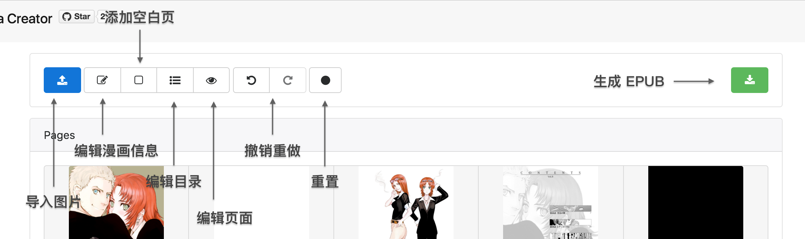
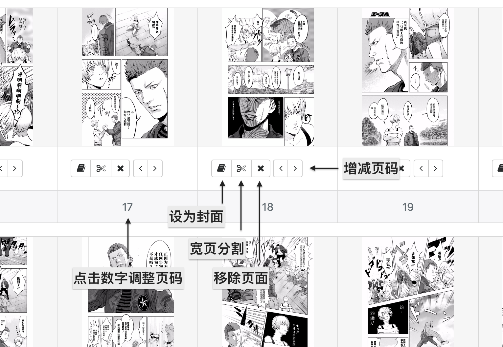
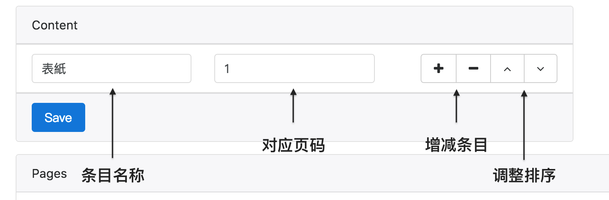
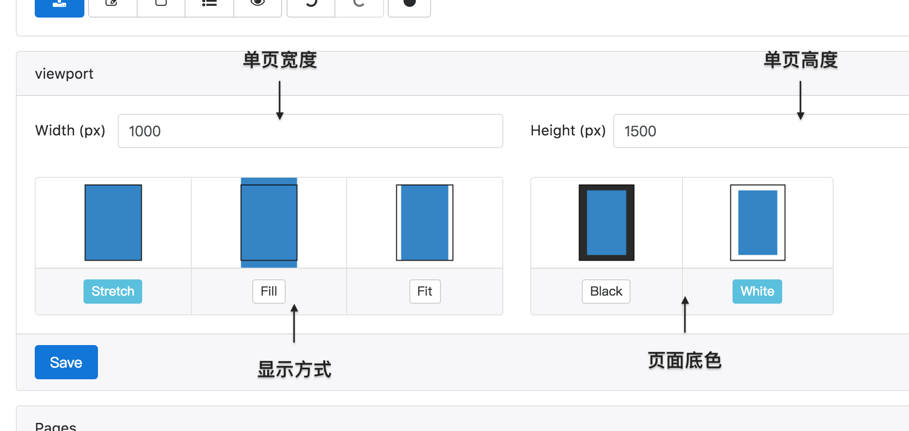

# 关于这个程序

这是一个可以将多张漫画图片打包成一个EPUB文件的程序，
最初是为了在Mac系统下更好的管理那些乱七八糟的漫画，
把它们打包成zip的话查看起来又麻烦，不打包的话又会显得文件很多从而影响搜索文件的效率，拷贝起来也麻烦。
于是就想着做成epub文件，这样整理起来就会方便很多，而且阅读体验也比用图片查看软件好得多。

现有的epub制作软件都太复杂，有一定的学习成本，而我只是纯粹的想把一堆图片打包而已，而且靠着那些软件
制作出来的epub漫画质量还不一定好。于是我就利用春节假期的一周时间，写出了这个打包程序。

整个程序完全前端运作，使用html5技术，无后台交互。你可以把程序下载下来在本地运行。

打包出来的epub为3.0版本，文件结构采用的是“日本电子漫画协会” ([デジタルコミック協議会 Digital Comic Association](http://www.digital-comic.jp/)) 制定的标准

# 功能说明

## 控制板

   - **导入图片**：就是导入图片……
   - **漫画信息**：点开后可以编辑 书名、作者、分类、语言，编辑完后记得要点保存，后边的一些操作都类似。
   - **目录**：可以编辑漫画的目录链接
   - **增加空白页**：调整漫画页码错位的问题
   - **撤销重做**：可以避免一些错误操作，例如不小心移除了页面，点了宽页切割之类的。
   - **重置**：当你制作完一本漫画准备接着做下一个的时候，可以点击这个按钮。注意：这个操作会清空撤销历史（无法撤销）

## 图片调整面板

   - **设为封面**：点击后该页面将用作漫画的封面
   - **宽页切割**：将一些双拼页图片从中间分割还原为两页
   - **移除页面**：删除没用的页面
   - **页码数字**：点击数字的页码，会弹出一个对话框，输入数字。就可以将页面移至目标页码位
   - **增减页码**：向左或者向右调整页码

## 目录编辑

## 页面编辑

  - **单页宽高**：每一页的尺寸，如果不知道该输入什么的话，可以直接参考封面图片的宽高来输入。
  - **显示方式**：每一张图片在页面内的显示方式，默认为拉伸（适合电子版漫画），其余两项分别是“填满页面”和“适合页面”（适用于扫图）
  - **页面底色**：页面空出来的部分用的填充颜色，选择“适合页面”的时候会起作用。